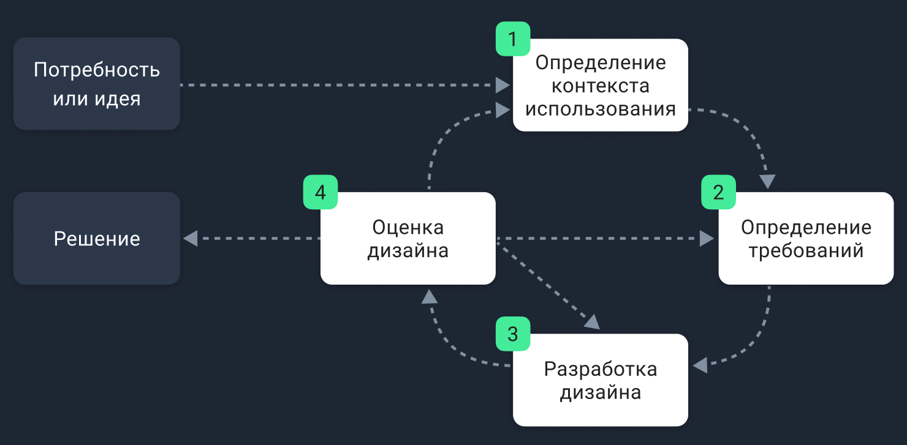

# Понятие UX/UI-дизайна / Профессия UX/UI-дизайнер
В этом проекте ты познакомишься с понятием UX/UI-дизайна и профессией UX/UI-дизайнера, которые отвечают за создание удобного и привлекательного пользовательского интерфейса, обеспечивая позитивный опыт взаимодействия пользователей с продуктом.

## Contents

1. [Chapter I](#chapter-i)\
    1.1 [Общая инструкция](#общая-инструкция)
2. [Chapter II](#chapter-ii) \
1.1 [UX/UI-дизайн](#ux/ui-дизайн) \
1.2 [Task 1](#task-1) \
1.3 [UX-дизайн](#ux-дизайн) \
1.4 [UI-дизайн](#ui-дизайн) \
1.5 [UX/UI-дизайнер это не только о красивых картинках](#notdesign) 
3. [Chapter III](#chapter-iii) \
    3.1 [Пайплайн работы](#пайплайн) \
    3.2 [Task 2](#task-2) 

<h2 id="chapter-i">Chapter I</h2> 
<h3 id="общая-инструкция">Общая инструкция</h3>

Методология Школы 21 может быть не похожа на тот образовательный опыт, который случался с тобой ранее. Её отличает высокий уровень автономии: у тебя есть задача, ты должен её выполнить. По большей части тебе нужно будет самому добывать знания для её решения. Второй важный момент — это peer-to-peer обучение. В образовательном процессе нет менторов и экспертов, перед которыми ты защищаешь свой результат. Ты это делаешь перед такими же учащимися, как и ты сам. У них есть чек-лист, который поможет им качественно выполнить приемку вашей работы.

Роль Школы 21 заключается в том, чтобы обеспечить через последовательность заданий и оптимальный уровень поддержки такую траекторию обучения, при которой ты не только освоишь hard skills, но и научишься самообучаться.

- Не доверяй слухам и предположениям о том, как должно быть оформлено ваше решение. Этот документ является единственным источником, к которому стоит обращаться по большинству вопросов;
- твое решение будет оцениваться другими учащимися;
- подлежат оцениванию только те файлы, которые ты выложил в GIT (ветка develop, папка src);
- в твоей папке не должно быть лишних файлов — только те, что были указаны в задании;
- не забывай, что у вас есть доступ к интернету и поисковым системам;
- обсуждение заданий можно вести и в мессенджерах;
- будь внимателен к примерам, указанным в этом документе — они могут иметь важные детали, которые не были оговорены другим способом;
- и да пребудет с тобой Сила!

<h2 id="chapter-ii">Chapter II</h2> 
<h3 id="ux/ui-дизайн">UX/UI-дизайн</h3>

UX (User Experience) и UI (User Interface) дизайн являются двумя важными аспектами разработки продуктов, которые направлены на создание удобного и приятного опыта пользователей. Хотя они тесно связаны, они имеют разные задачи и акценты. Кроме того, UX/UI-дизайн — это непрерывный процесс, который направлен на создание и улучшение интерфейсов продукта, которые будут соответствовать потребностям пользователей.

Большинство интерфейсов проектируются по принципу HCD (Human-Centered Design) — это человеко-ориентированное проектирование пригодных в использовании и полезных интерактивных систем с учётом особенностей пользователей и их потребностей на основе эргономических принципов.

В нашей жизни мы постоянно встречаемся с различными интерфейсами. Сайты, web-приложения, всё это является интерфейсами, но только ли?

<h3 id="task-1">Task 1</h3>

* создай файл interfaces в формате .md или .txt;
* напиши в файле interfaces, какие ещё интерфейсы, помимо мобильных и web существуют (обрати внимание на различные платформы). Напиши как минимум 5 вариантов.

<h3 id="ux-дизайн">UX-дизайн</h3>

UX расшифровывается как User Experience или пользовательский опыт. UX-дизайн (дизайн пользовательского опыта) ориентирован на обеспечение удовлетворения пользовательских потребностей и достижения конкретных целей, связанных с использованием продукта. Он фокусируется на понимании пользователей, их поведения, потребностей и целей. 

Задача UX-дизайнера состоит в создании эффективного и удовлетворительного пользовательского пути, начиная с момента, когда пользователь взаимодействует с продуктом и до момента его завершения. UX-дизайнер занимается исследованиями пользователей, созданием пользовательских путей и прототипов, а также тестированием и улучшением продукта на основе обратной связи пользователей.

UX описывает пользовательский опыт как целое, принимая во внимание не только пользовательские взаимодействия с определенным сайтом или приложением, но также их чувства по отношению к продукту или бренду, а также то, удовлетворяет ли он их потребности. В UX-дизайне акцент идёт на удобство использования, которое достигается за счёт изучения пользователя и его поведенческих особенностей, а также использования полученных данных для проектирования интерфейса.

<h3 id="ui-дизайн">UI-дизайн</h3>

UI расшифровывается как User Interface или пользовательский интерфейс. UI-дизайн (дизайн пользовательского интерфейса) отвечает за создание визуальной и функциональной оболочки продукта, с которой пользователь будет взаимодействовать. В процессе работы дизайнер разрабатывает элементы интерфейса, такие как кнопки, иконки, шрифты и цветовую схему. Он также создает макеты, которые служат основой для разработки конечного продукта.

Задача UI-дизайнера состоит в создании привлекательного и интуитивно понятного интерфейса, который облегчает пользовательскую навигацию и взаимодействие с продуктом.

<h3 id="notdesign">UX/UI это не только о красивых картинках</h3>

Часто существует неправильное представление о UX/UI-дизайне, как о процессе создания просто красивых картинок или интерфейсов. Однако, на самом деле, основная цель UX/UI-дизайна заключается в создании удобного и приятного для пользователя опыта взаимодействия с продуктом. 
 
Это включает в себя понимание потребностей пользователей, проведение исследований, тестирование, анализ данных и итеративное улучшение интерфейса.

UX/UI, это: 

 - Ориентация на пользователя
 - Информационная архитектура
 - Пользовательские пути и сценарии
 - Прототипирование и тестирование
 - Визуальное оформление

<h2 id="chapter-iii">Chapter III</h2> 
<h3 id="пайплайн">Пайплайн работы</h3>

Пайплайн рабочего процесса — это последовательность шагов или этапов, которые выполняются для достижения определенной цели или обработки данных. Пайплайны рабочих процессов широко используются в различных отраслях и областях, включая разработку программного обеспечения, анализ данных, производство, маркетинг и другие. 

Основная идея пайплайна рабочего процесса состоит в том, чтобы разбить сложную задачу на более простые и логически связанные этапы, которые могут быть последовательно выполнены. Каждый этап обрабатывает входные данные или результаты предыдущего этапа и передает их следующему этапу. Таким образом, пайплайн рабочего процесса создает цепочку этапов, где каждый этап является входом для следующего этапа.

Пайплайн UX/UI-дизайнера выглядит следующим образом:
* сбор информации по проекту;
* UX-исследование;
* UX-проектирование интерфейса (и всего опыта взаимодействия с продуктом);
* создание и тестирование прототипа;
* визуальная проработка макетов интерфейса;
* анализ и тестирование разработанного интерфейса.

Иногда, после тестирования прототипа, возникает потребность снова вернуться к пунктам до него, вплоть до сбора информации. А после тестирования уже готового интерфейса и проведения анализа бывает необходимость пройти весь путь от начала и до конца.

<h3 id="task-2">Task 2</h3>

* создай файл favourite-ui в формате .md или .txt;
* напиши в файле favourite-ui как минимум пять примеров взаимодействия с интерфейсами из своей жизни, которые вызвали у тебя положительный опыт и пять примеров, в которых ты бы предложил улучшения для интерфейса. Опиши эти улучшения для каждого из отрицательных примеров.
* по возможности приложи скриншоты к примерам

>Пожалуйста, оставьте обратную связь по проекту в [форме обратной связи.](https://docs.google.com/forms/d/e/1FAIpQLScOMa4bDjRYlv1H6ElSi_cLVa_2rf2hrxNuXWztKqMerck4CQ/viewform?usp=sf_link)
