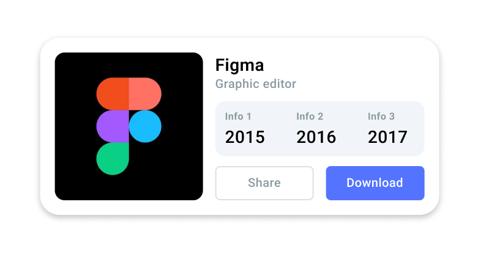
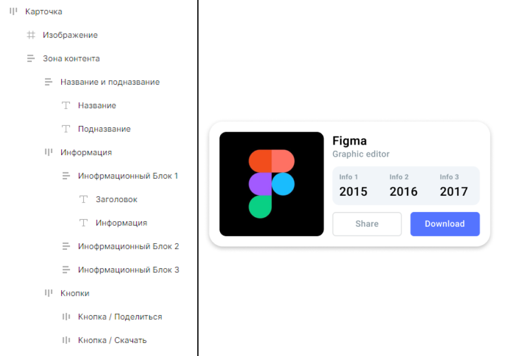
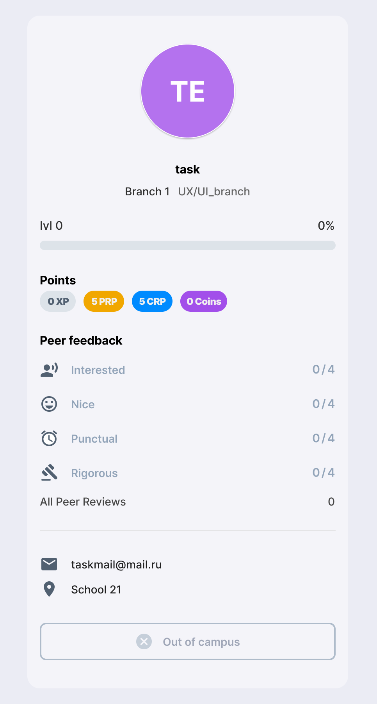

# Инструментарий UX/UI-дизайнера
В этом проекте ты познакомишься с основными инструментами, которые применяет UX/UI-дизайнер

## Contents

1. [Chapter I](#chapter-i) \
    1.1 [Инструменты UX/UI-дизайнера](#инструменты-uxui-дизайнера)
2. [Chapter II](#chapter-ii) \
    2.1 [Инструментарий для поиска решений](#инструментарий-для-поиска-решений) \
    2.2 [Task 1](#task-1)
3. [Chapter III](#chapter-iii) \
    3.1 [Основной инструментарий](#основной-инструментарий) \
    3.2 [Task 2](#task-2) \
    3.3 [Task 3](#task-3) 

<h2 id="chapter-i">Chapter I</h2> 
<h3 id="инструменты-uxui-дизайнера">Инструменты UX/UI-дизайнера</h3>

До появления инструментов для проектирования интерфейсов использовались различные графические редакторы, такие как Photoshop и Illustrator. В подобных программах не было возможности для командной работы. Макеты, которые экспортировались из таких программ, были неудобны для реализации разработчиками, а также для самих дизайнеров, поскольку эти инструменты не были предназначены для проектирования интерфейсов.

Помимо проектирования интерфейсов, UX/UI-дизайнеру может понадобиться выполнить такие задачи, как:
- отрисовать иконку в заданной стилистике или отрисовать набор иконок с нуля
- отрисовать иллюстрацию
- сделать 3D-мокап
- сделать видео с демонстрацией сложной анимации интерфейса (например, нестандартное открытие меню)

Поэтому, помимо владения программой для проектирования интерфейсов, дизайнеру полезно изучать инструменты для создания растровой и 3D-графики, а также для анимирования, такие как:

- **Blender**
- **After Effects**
- **Principle**

<h2 id="chapter-ii">Chapter II</h2> 
<h3 id="инструментарий-для-поиска-решений">Инструментарий для поиска решений</h3>

Для поиска возможных решений тех или иных кейсов и развития насмотренности существует множество сайтов, на которых выложены работы других дизайнеров.
Например:
- **Awwwards** — сайт конкурса профессиональных веб-дизайнеров и разработчиков, на котором выкладывают свои работы профессиональные дизайнеры. Хорошо использовать этот ресурс для вдохновения, забирать удачные цветовые решения. Cледует помнить, что большинство представленных интерфейсов сделаны для конкурса, и, чаще всего, UX-решения не пригодны для использования в повседневных сервисах.
- **Behance** —  платформа, на которой дизайнеры различных направлений публикуют свои работы. На ней можно найти много интересных концепций, готовых интерфейсов, примеров оформления кейсов и многое другое.
- **Pinterest** — визуальный инструмент для поиска идей, где каждый может сделать свою доску и с её помощью сохранять идеи для себя. Так же есть поиск по доскам других пользователей, что позволяет быстро найти приемлемые решения для своих идей.
- **Dribbble** — еще один ресурс для про-дизайнеров, на который принято загружать «шоты» — красивые изображения интерфейсов, идеи, визуализации. Хорошо использовать для поиска вдохновения и удачных цветовых решений.

В процессе дизайна важно смотреть аналоги того продукта, над которым ты работаешь. Если это, например, интернет-магазин, то необходимо посмотреть уже существующие крупные интернет-магазины, чтобы увидеть различные варианты реализации интересующего тебя функционала.

<h3 id="task-1">Task 1</h3>

* найди экран любого интерфейса или его элемента (должны включать в себя кнопки, текст и изображения), которое понравится, можно воспользоваться в том числе платформами, о которых говорилось выше. \
Пример: \

* сделай скриншот найденного фрагмента интерфейса или скачай изображение
* назови изображение task_1
* загрузи скриншот в формате .png в репозиторий

<h2 id="chapter-iii">Chapter III</h2> 
<h3 id="основной-инструментарий">Основной инструментарий</h3>

Проектирование интерфейсов происходит в специальных приложениях. \
Самыми широкоиспользуемыми являются **Figma**, **Sketch**, **Pixso** и **Adobe XD**. Некоторые из этих приложений имеют браузерные версии, некоторые — нет. Мы не будем сейчас углубляться в их различия, на нашем курсе мы будем использовать **Figma**.

<h3 id="task-2">Task 2</h3>

* создай аккаунт в Figma
* создай Design файл и назови его day-2
* перенеси в созданный файл скриншот фрагмента интерфейса из Task 1, чтобы можно было сравнить с созданным тобой фрагментом
* повтори фрагмент интерфейса, который ты нашёл, в Figma, используя простые фигуры, текстовые поля и т.д. (изображение нужно вставить картинкой, также, можно использовать готовые наборы иконок)
* переименуй все части фрагмента интерфейса соответствующими им именами в списке элементов\
Например: изображение, кнопка, текст кнопки, заголовок описания, текст описания, название предмета\

* экспортируй файл в формате .fig и загрузи его в папку репозитория.

<h3 id="task-3">Task 3</h3>

* создай в своём файле day-2 новую страницу
* назови новую страницу Task 3
* перенеси изображение карточки ниже в свой файл Figma:\

* повтори карточку, представленную на изображении
* в Figma назови каждый слой в соответствии с элементом карточки, за который он отвечает, например — слой с кнопкой будет назван «кнопка»
* экспортируй файл в формате .fig и обнови файл Project_2.fig в репозитории

>Пожалуйста, оставьте обратную связь по проекту в [форме обратной связи.](https://docs.google.com/forms/d/e/1FAIpQLSeojRk4clJ5q3LI5VLSYiS0ZUqSbYrDwPYNaz8_Q4NygfvG9w/viewform?usp=sf_link)
