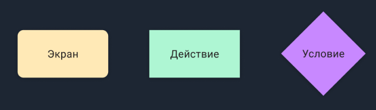

# UX-проектирование
Познакомитесь с инструментами для проектирования, типами UX-проектирования и UX-правилами и паттернами 

## Contents

1. [Chapter I](#chapter-i) \
    1.1 [Начало проектирования интерфейсов на основе информации из UX-исследований](#начало-проектирования) 
2. [Chapter II](#chapter-ii) \
    2.1 [Виды UX-проектирования и их принципы](#виды-ux-проектирования-и-их-принципы) \
    2.2 [Task 1](#task-1) \
    2.3 [Правила и паттерны](#правила-и-паттерны) \
    2.4 [UX-паттерны](#ux-паттерны) \
    2.5 [UX-правила](#ux-правила) \
    2.6 [Task 2](#task-2) 
3. [Chapter III](#chapter-iii) \
    3.1 [Cоставление userflow пользователя для сервиса](#userflow) \
    3.2 [Task 3](#task-3) \ 
    3.3 [Task 4](#task-4) 

<h2 id="chapter-i">Chapter I</h2> 
<h3 id="начало-проектирования">Начало проектирования интерфейсов на основе информации из UX-исследований</h3>

Когда начинается проектирование интерфейсов, важно учитывать информацию, полученную из UX-исследований. Это может включать в себя данные о пользователях, их потребностях, ожиданиях и целях. Понимание этих факторов помогает создать интерфейс, который соответствует потребностям пользователей и обеспечивает оптимальный пользовательский опыт. 

На основе данных UX-исследований выявляются основные цели и задачи пользователей, которые должны быть учтены при проектировании интерфейсов.

<h2 id="chapter-ii">Chapter II</h2> 
<h3 id="виды-ux-проектирования-и-их-принципы">Виды UX-проектирования и их принципы</h3>

В UX-проектировании существует несколько различных видов, каждый из которых имеет свои принципы. Некоторые из них включают:

- Макетирование и визуальное проектирование: здесь уделяется внимание разработке графического представления интерфейса, включая цвета, шрифты, компоновку элементов и т.д., чтобы создать привлекательный и понятный дизайн
- Интерактивный дизайн: этот вид UX-проектирования занимается созданием интерактивных элементов, таких как кнопки, выпадающие меню, формы и т.д., чтобы обеспечить удобство использования и отзывчивость интерфейса

<h3 id="task-1">Task 1</h3>

* создай файл “ux-project” и в нем сделай новый artboard
* расскажи о роли макетирования и визуального проектирования в создании эффективного и привлекательного интерфейса. Перечисли хотя бы 3 пункта, для чего нужны эти этапы разработки дизайна
* объясни, что такое интерактивный дизайн и почему он важен для обеспечения удобства использования интерфейса. Перечисли хотя бы 3 причины, почему интерактивный дизайн важен для обеспечения удобства использования интерфейса
<h3 id="правила-и-паттерны">Правила и паттерны</h3>

Представив структуру сервиса в текстово-схематичном виде, самое время переходить к проектированию интерфейса будущего приложения, однако, прежде чем приступать к генерации идей, необходимо ознакомиться с тем, как это сделать более корректно.

<h3 id="ux-паттерны">UX-паттерны</h3>

UX-паттерн — это решение «проблемы» (в случае UX/UI-дизайна, проблемой будет то, как спроектировать тот или иной функционал сервиса), которое «зарекомендовало» себя, как удачное и которым пользуется большое количество пользователей.

Существует множество различных UX-паттернов. С развитием технологий разработки, появляются новые решения, которые вытесняют более устаревшие.

<h3 id="ux-правила">UX-правила</h3>

С помощью исследований, были получен набор UX-законов, которые важно применять при проектировании интерфейсов.

Одними из основных являются:
* Закон Хика
* Закон Якоба
* Закон Фиттса
* Закон Миллера
* Закон Паркинсона

<h3 id="task-2">Task 2</h3>

* опиши в файле “ux-project” суть законов, описанных выше, применительно к UX/UI-дизайну
* найди ещё минимум 2 закона или принципа и опиши их суть в файле “ux-project”

<h2 id="chapter-iii">Chapter III</h2> 
<h3 id="userflow">Cоставление userflow пользователя сервиса</h3>

Userflow представляет собой последовательность действий, которые пользователь выполняет внутри интерфейса, чтобы достичь своей цели. Типичные шаги, которые нужны для составления userflow: 

- Идентификация целевых пользователей: определи основные группы пользователей, для которых разрабатывается сервис, и пойми их потребности и цели.
- Определение основных задач пользователей: идентифицируй основные шаги, которые пользователи должны выполнить для достижения своих целей при использовании сервиса.
- Создание пути пользователя (userflow): составь последовательность шагов и взаимодействий, которые пользователи должны выполнить, чтобы достичь своих целей. Userflow визуализирует путь пользователя от начала до конца взаимодействия с сервисом.

Userflow описывает конкретные последовательные действия пользователей в каждом сценарии. Чаще всего применяют блок-схемы с 3 «базовыми» блоками.

<h3 id="task-3">Task 3</h3>

* напиши объяснение, что такое целевые пользователи и почему их идентификация важна при составлении userflow
* опиши процесс определения основных задач пользователей и объясни, как это помогает в составлении userflow

<h3 id="task-4">Task 4</h3>

* создай пример userflow для сервиса заказа еды, включая основные шаги, которые пользователь должен выполнить для успешного заказа

>Пожалуйста, оставьте обратную связь по проекту в [форме обратной связи.](https://docs.google.com/forms/d/e/1FAIpQLSezCPndcFpSn-jin3zhE_ZT7zYSnk5DqePM5m8GmaIJqNSs-g/viewform?usp=sf_link)
